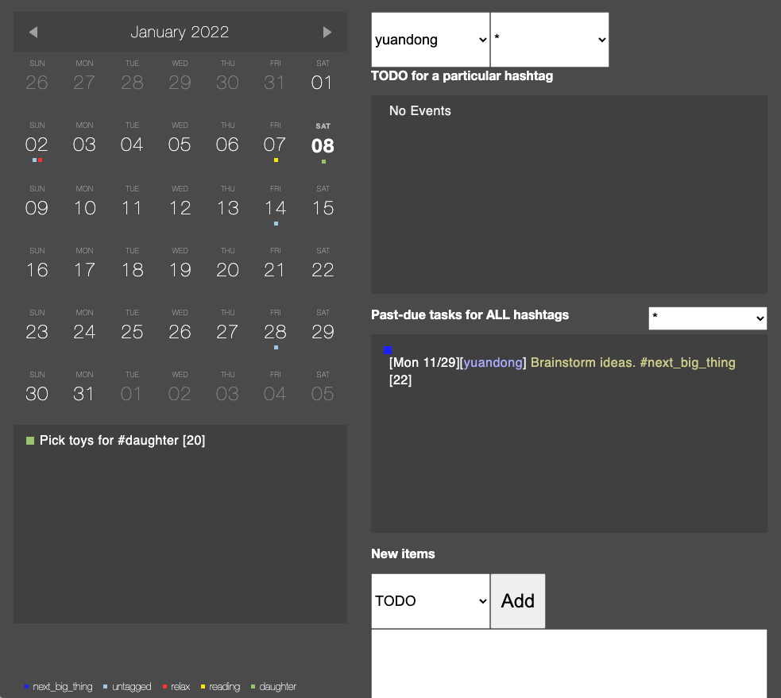

# A simple UI and backend for scheduling tasks

**Summary**. The core idea is to have one markdown file to store status of multiple projects, including reading summary, meeting notes, todo list, idea and thoughts, etc, and create read-only views for different purposes. This avoids having many scattered documents in multiple places (e.g., some in dropbox, some in google doc, etc.), which often causes headache and frustration. 

The tools is a combination of vscode plus python. 

In your VSCode setting, add the snippets as shown in `.vscode/snippet.code-snippets`:

Then you can write your markdown file (see `example.md` as an example) with shortcut like `!t[tab]`. It will expand to `!TODO[start=05:44 2021/12/31;deadline=]`, which automatically records the current timestamp. 
+ You can add content after the closing bracket. 
+ You can add the deadline. which can be absolute timestamp like `Nov. 23` or relative like `1d` (in a day), `1w` (in a week) or `eonw` (end of next week).
+ You can add who will do the task. E.g., `!TODO[start=06:16 2021/12/31;deadline=1w;who=yuandong]` means that `yuandong` will finish the task in a week.  

Finally you can run the following script to create a webpage to review.  
```
python run_plan.py upload
``` 
It will create `data.js`. View your calender by opening `run.html`. The UI is borrowed from [here](https://codepen.io/peanav/pen/ulkof).

 

If you want to deploy it to the http server that support php, replace `run_ftp` function with the uploading code snippets in `run_plan.py`. Also use `run.php` instead. It allows adding notes on the webpage and save it on the server side.  

# License 
MIT